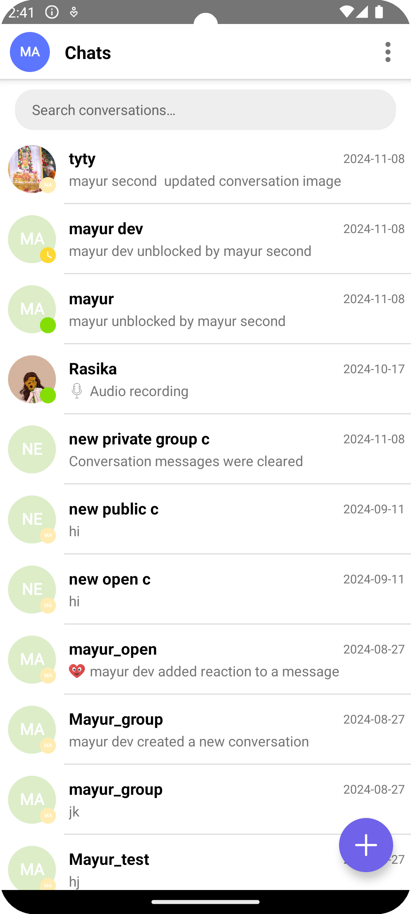

# Isometrik Chat Android

A simple chat library for Android applications.

## Adding it to your project

To use this library in your Android project, follow the steps below to add the required dependency.

### Step 1: Configure Project Repositories

Ensure your project's build.gradle (Project Level) file contains the following repositories:

```groovy
allprojects {
    repositories {
        mavenCentral()
        maven { url 'https://jitpack.io' }
    }
}
```

### Step 2: Add the Dependency

Open your build.gradle file (app-level) and add the following line in the dependencies section:

```groovy
dependencies {
    implementation 'com.github.isometrikai:isometrik-chat-android:1.2.5'
}
```
### Step 3: Sync Your Project

Once you've made the changes, sync your project with the Gradle files by clicking the "Sync Now" button in Android Studio.


# SDK Integration Guide

Follow the steps below to integrate and configure the Isometrik UI SDK in your Android project.

## Step 1: SDK Initialization

Initialize the SDK in your project's `Application` class, specifically within the `onCreate()` method.

```java
IsometrikChatSdk.getInstance().sdkInitialize(this);
```

## Step 2: SDK Configuration

Configure the SDK in the first method called in your app, typically within the `Application` class's `onCreate()` method. You will need the following details for configuration:

- `app_secret`
- `user_secret`
- `license_key`
- `google_places_api_key`
- `giphy_api_key`
- `accountId`
- `projectId`
- `keysetId`

Provide these details using the parameters in the method below:

```java
IsometrikChatSdk.getInstance()
        .createConfiguration(
            getString(R.string.app_secret),
            getString(R.string.user_secret),
            getString(R.string.accountId),
            getString(R.string.projectId),
            getString(R.string.keysetId),
            userName,
            password,
            getString(R.string.license_key),
            BuildConfig.APPLICATION_ID,
            getString(R.string.app_name),
            getString(R.string.google_places_api_key),
            getString(R.string.giphy_api_key)
        );

        IsometrikChatSdk.getInstance()
                            .getUserSession()
                            .switchUser(isoMetricUserId, isoMetricToken, userName, userIdentifier,
                                    userProfilePic, false, new JSONObject(),true,0);

```
To handle SDK termination, call the following method, usually in the onTerminate() method of the Application class:

```java
IsometrikChatSdk.getInstance().onTerminate();
```

## Step 3: Create a Connection

Establish a connection on the base screen of your app (e.g., `MainActivity` or `LandingActivity`) before accessing the chat functionality. You will need the following details:

- `userClientId` (isometrikUserId)
- `userIsometrikToken`

Use the following method to create a connection:

```java
IsometrikChatSdk.getInstance().getIsometrik().createConnection(userClientId, userIsometrikToken);
```

### Step 4: Start a Conversation
You are now ready to start a conversation. You can launch ConversationsListActivity or load ConversationsListFragment from any click action in your app:

```java
 Intent intent = new Intent(this, ConversationsActivity.class);
 startActivity(intent);
```
  for fragment
```java
ConversationsListFragment fragment = new ConversationsListFragment();

getSupportFragmentManager()
        .beginTransaction()
        .replace(R.id.fragment_container, fragment)
        .commit();
```

### Create a Conversation
start new conversation from any action in your project

```java
  isometrik.getRemoteUseCases()
                .getConversationUseCases()
                .createConversation(new CreateConversationQuery.Builder().setUserToken(userToken)
                        .setGroup(false)
                        .setConversationType(0)
                        .setMembers(Collections.singletonList(selectedUserId))
                        .setReadEvents(enableMessageDeliveryReadEvents)
                        .setTypingEvents(enableMessageTypingEvents)
                        .setPushNotifications(enablePushNotifications)
                        .setSearchableTags(searchableTags)
                        .build(), (var1, var2) -> {
                    if (var1 != null) {
                        String conversationId = var1.getConversationId();
                        Intent intent =
                                      new Intent(YourActivity.this, ConversationMessagesActivity.class);
                                intent.putExtra("messageDeliveryReadEventsEnabled",true);
                                intent.putExtra("typingEventsEnabled",true);
                                intent.putExtra("newConversation", true);
                                intent.putExtra("conversationId", conversationId);
                                intent.putExtra("isPrivateOneToOne", true);
                                intent.putExtra("userName", your.userName);
                                intent.putExtra("userImageUrl", your.profilePicUrl);
                                intent.putExtra("isOnline", false);
                                intent.putExtra("lastSeenAt", "");
                                intent.putExtra("userId", your.userId);
                                startActivity(intent);
                    }
                });

```

# Customization

## Handle a Custom Activity from Your Module

To open a new screen for app module used below click listeners.

```kotlin

  IsometrikChatSdk.getInstance().addClickListeners(object : ChatActionsClickListener {

              override fun onCreateChatIconClicked(isGroup: Boolean) {
              // here default screen mentioned from SDK. We can respected screen from here.
                  if (isGroup) {
                        val i = Intent(
                          this,
                          io.isometrik.ui.conversations.newconversation.group.NewGroupConversationActivity::class.java
                      )
                      i.putExtra("conversationType", ConversationType.PrivateConversation.value)
                      startActivity(i)
                  } else {
                      val i = Intent(
                          this,
                          io.isometrik.ui.conversations.newconversation.onetoone.NewOneToOneConversationActivity::class.java
                      )
                      startActivity(i)
                  }

              }

              override fun onBlockStatusUpdate(isBlocked: Boolean, userId: String) {
              }

              override fun onCallClicked(
                  isAudio: Boolean,
                  userId: String,
                  meetingDescription: String,
                  opponentName: String,
                  opponentImageUrl: String
              ) {

              }

              override fun onSharedPostClick(postId: String) {

              }

              override fun onViewSocialProfileClick(userId: String) {

              }
          })

```

## Add custom view in ChatList Screen

```kotlin

     val customBinder = object : ChatListItemBinder<ConversationsModel, ChatItemBinding> {
            override fun createBinding(parent: ViewGroup): ChatItemBinding {
                return ChatItemBinding.inflate(LayoutInflater.from(parent.context), parent, false)
            }

            override fun bindData(context: Context, binding: ChatItemBinding, data: ConversationsModel) {
                binding.chatName.text = data.conversationTitle
                binding.chatLastMessage.text = data.lastMessageSenderName

            }
        }

        val chatFragment = ConversationsListFragment.newInstance(customBinder)

        supportFragmentManager.beginTransaction()
            .replace(R.id.fragmentContainer, chatFragment)
            .commit()

```

### Change the Base Color

To change the theme color of the module, add the following color name to your module's colors.xml file:

```java
<color name="ism_theme_base">#YOUR_COLOR_HEX</color>
<color name="ism_conversation_bg">#YOUR_COLOR_HEX</color>
<color name="ism_send_message_bg">#YOUR_COLOR_HEX</color>
```
Replace #YOUR_COLOR_HEX with your desired color value.


# Technical details

* compileSdkVersion  = 34
* buildToolsVersion = '34.0.0'
* targetSdkVersion 34
* Android gradle plugin 8.4.0
* sourceCompatibility 17
* targetCompatibility 17
* JDK version 17
* Kotlin version 1.9.23
* One Signal version 5.1.21

<p float="left">
  
  
</p>

